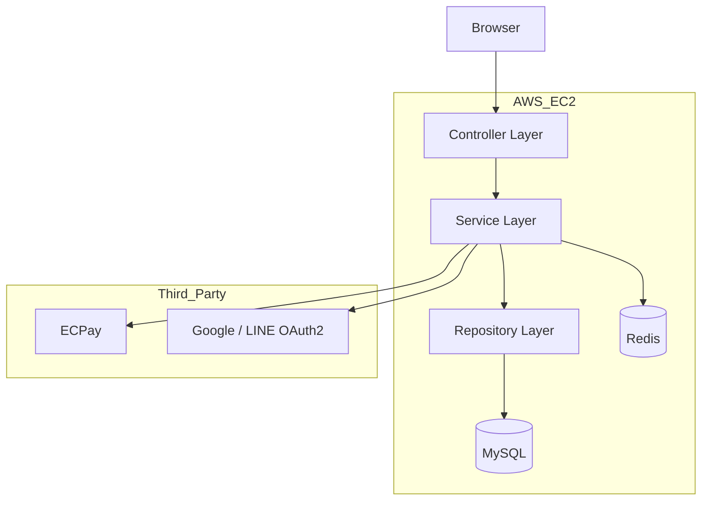

# OIKOS – 家具電商平台


> OIKOS 是一個基於 Spring Boot 3 與 AWS 雲端架構建構的全端電商平台，  
> 模擬企業級高流量環境下的實際商業運作流程。

---

## 專案概述 (Project Overview)

OIKOS 專注於解決傳統 Web 應用在高併發環境下常見的效能瓶頸、狀態管理複雜度與第三方服務整合問題。

本專案採用 **分層式單體架構（Layered Monolithic Architecture）**，  
在確保可維護性的前提下，導入 Redis 作為快取與分散式 Session 儲存。

系統整合 Spring Security 實作角色權限控管（RBAC），  
並完整串接綠界金流（ECPay），涵蓋金流、物流與支付回調驗證流程。

---

## 核心技術亮點

- Redis 快取首頁熱點商品與商品分類資料
- 分散式 Session 設計，支援無狀態伺服器
- Spring Security + BCrypt 密碼加密
- OAuth2（Google / LINE）第三方登入
- 綠界金流（ECPay）AIO API 整合
- AWS EC2（Ubuntu 24.04）雲端部署
- Linux Swap 虛擬記憶體配置

---

## 關鍵功能 (Key Features)

### 使用者認證與安全 (Authentication)

- 本地帳號註冊與登入
- OAuth2 第三方登入
- ROLE_ADMIN / ROLE_MEMBER 權限控管
- Redis Session 儲存

### 商品與購物體驗 (Shopping Experience)

- 商品列表 Redis 快取
- AJAX 非同步購物車
- RWD 響應式設計
- 動態商品展示效果

### 訂單與支付系統 (Order & Payment)

- 訂單建立與狀態管理
- 綠界金流支付流程
- 電子地圖選擇超商門市
- @Transactional 確保交易一致性

### 開發體驗與文件 (Developer Experience)
* **Swagger UI**：提供視覺化的 API 測試介面，無需 Postman 即可直接於瀏覽器測試後端介面。
* **OpenAPI 規範**：遵循 OpenAPI 3.0 標準，支援自動生成前端 Client Code。

---

## 技術棧 (Technology Stack)

| 類別 | 技術項目 |
| :--- | :--- |
| **後端框架** | Java 17, Spring Boot 3.x, Spring MVC |
| **API 文件** | **SpringDoc OpenAPI 3.0 (Swagger UI)** |
| **安全性** | Spring Security 6, OAuth2 Client (Google/LINE/FB) |
| **資料庫** | MySQL 8.0, Spring Data JPA (Hibernate) |
| **快取機制** | Redis (Spring Data Redis, Spring Session) |
| **前端技術** | HTML5, CSS3, Bootstrap 5, jQuery, SweetAlert2 |
| **基礎設施** | AWS EC2 (Ubuntu 22.04), Linux Swap, Maven |
| **外部 API** | ECPay (金流/物流), Facebook Graph API |

---

## 系統架構 (System Architecture)

本專案採用分層式單體架構，透過清楚的職責分離，  
確保系統具備良好的可維護性與擴充性。


---
# 購物網站專案文件 (Shopping Project Documentation)

## 專案結構 (Project Structure)

```plaintext
src/main/java/com/tw/shopping/main/
├── config/          # 系統設定
├── controller/      # Controller 層
├── service/         # Service 層
├── repository/      # Repository 層
├── entity/          # JPA Entity
├── dto/             # DTO
├── util/            # 工具類
└── exception/       # 全域例外處理
```
---
# 安裝與啟動 (Installation & Setup)

## 環境需求 (Prerequisites)
* Java Development Kit (JDK) 17 以上
* MySQL Server 8.0 以上
* Redis Server
* Maven
  
### 步驟 1：複製專案
```bash
git clone [https://github.com/Mkie401/ShoppingProject.git]
cd shoppingProject
```

### 步驟 2：資料庫與設定

建立資料庫SQLCREATE DATABASE shopping;
設定檔 (application.properties)請確認 src/main/resources/application.properties 包含以下設定：

- spring.datasource.url=jdbc:mysql://localhost:3306/shopping?useSSL=false&serverTimezone=Asia/Taipei
- spring.datasource.username=root
- spring.datasource.password=your_password

- spring.data.redis.host=localhost
- spring.data.redis.port=6379

- ecpay.merchant-id=2000132
- ecpay.hash-key=5294y06JbISpM5x9
- ecpay.hash-iv=v77hoKGq4kWxNNIS

### 步驟 3：建置與執行

建置專案 (跳過測試)
- ./mvnw clean package -DskipTests

啟動 Spring Boot 應用程式
- ./mvnw spring-boot:run

### 瀏覽器存取：http://localhost:8080

---

# API 文件與測試 (API Documentation)


### 本專案整合了 Swagger UI，啟動伺服器後，您可以透過以下網址查看完整的 API 文件並進行線上測試：
- Swagger UI 介面：http://localhost:8080/swagger-ui/index.html
- OpenAPI JSON 描述檔：http://localhost:8080/v3/api-docs

| HTTP 方法 | Endpoint | 功能描述 | 權限需求 |
| :--- | :--- | :--- | :--- |
| **POST** | `/api/login` | 使用者登入並建立 Session | 公開 |
| **GET** | `/api/user/me` | 取得當前登入使用者資訊 | 需登入 |
| **GET** | `/api/products` | 取得商品列表（Redis 快取） | 公開 |
| **POST** | `/api/cart/add` | 加入商品至購物車 | 需登入 |
| **POST** | `/api/orders/create` | 建立訂單並導向綠界（ECPay）支付 | 需登入 |

---

##  開發團隊與貢獻 (Contributors)

感謝以下核心開發成員的協作與技術貢獻：

* **[Mkie401](https://github.com/Mkie401)**         - 首頁前後端開發、基礎建設部署 (VM, DNS)、Git 專案管理、第三方金流與物流串接
* **[Sulayee](https://github.com/Sulayee)**         - 產品列表頁開發、搜尋功能引擎設計、前後端整合、交易鎖 (Transaction Lock) 機制設計
* **[smallke0207](https://github.com/smallke0207)** - 用戶認證系統 (登入/註冊/OAuth)、第三方登入串接、系統資安設定與資料加密
* **[XuYo1014](https://github.com/XuYo1014)**       - 產品詳情頁開發、庫存管理系統邏輯設計 (Inventory Management)、商品狀態維護
* **[kouisenhii](https://github.com/kouisenhii)**   - 會員中心前後端開發、安全機制設計、收藏清單功能 (Wishlist)[Kouisen的技術專欄].(https://medium.com/@kouisengetnews)
***
⚠️ 安全性說明 (Security Notice) 本專案已開啟 GitHub Push Protection。為了確保開發環境安全，所有敏感金鑰（Secrets）均已從 Git 歷史紀錄中移除，並改以環境變數管理。若您需於本地運行測試，請參考 application.properties.example 進行配置
